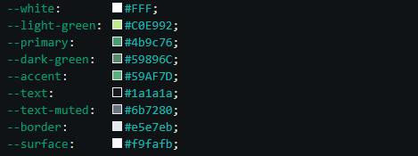

## Portfolio – Míriam Domínguez Martínez    


**Author:** Míriam Domínguez Martínez  
**Status:** In progress    
**Live:** [](https://miriam-dominguezm.com)

---

### About

Personal portfolio website built with HTML and CSS. Designed to be minimal, clean, and developer-flavoured — featuring a recreated VSCode panel as the hero visual.    

---

### File Structure

```
/
├── index.html
├── styles.css
└── README.md
```

---

### Tech Stack ☘️

- HTML5
- CSS3 (custom properties, grid, flexbox)
- Font: JetBrains Mono + Syne (Google Fonts)

---

### Colour Palette



---

*Currently studying and building every day.* 🌱
