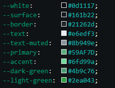

## Portfolio    


**Author:** Míriam Domínguez Martínez  
**Status:** In progress    
**Live:** [](https://miriam-dominguezm.com)

---

### About

Personal portfolio website built with HTML - CSS - JavaScript. Designed to be minimal, with dark mode, clean, and developer-flavoured, featuring a recreated VSCode panel as the hero visual.    

---

### File Structure ☘️

```
/
├── index.html
├── styles.css
├── script.js
├── README.md
├── CNAME
├── gif/
│   └── plant.gif
├── img/
│   ├── code.png
│   ├── colors.png
│   ├── colors-dark.png
│   └── template.png
└── font/
    ├── JetBrainsMono-Regular.woff2
    ├── JetBrainsMono-Bold.woff2
    ├── SourceCodePro-Regular.ttf.woff2
    ├── SourceCodePro-Bold.ttf.woff2
    ├── SpaceMono-Regular.ttf
    └── SpaceMono-Bold.ttf
```

---

### Colour Palette

Ligth mode:  

  

Dark mode:  

  

---

*Currently studying and building every day.* 🌱
